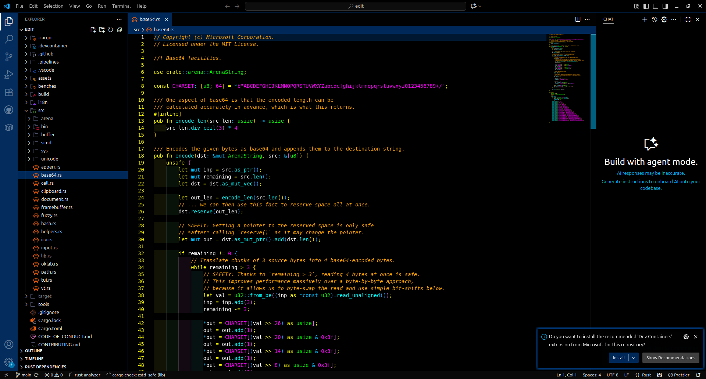

<a href="https://github.com/Foorack/coderack-theme/blob/main/LICENSE">
    
</a>
<a href="https://github.com/Foorack/coderack-theme/stargazers">
    
</a>

# Coderack Theme

**Coderack is a Vim-insipred strong-contrast dark theme, for VSCode and code-server.**

Strongly recommended to use `catppuccin-latte` as your Icon theme.

```bash
ext install Catppuccin.catppuccin-vsc-icons
```
